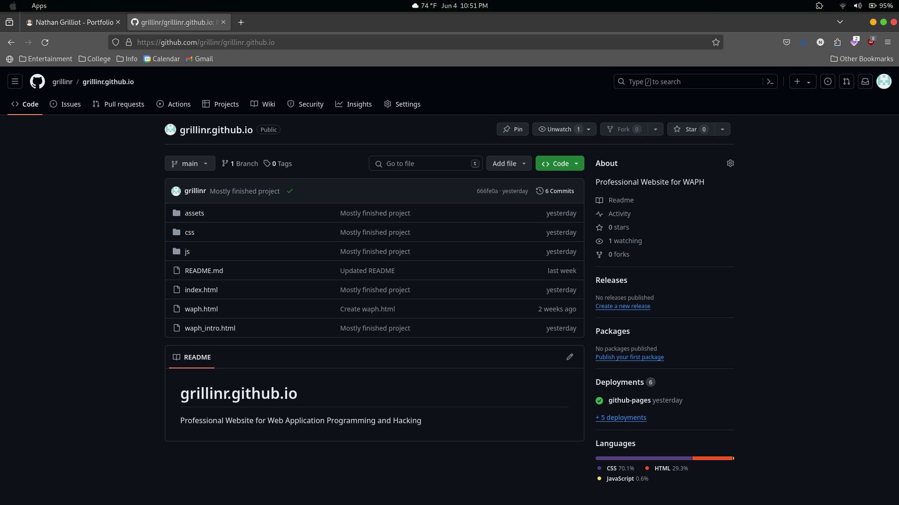
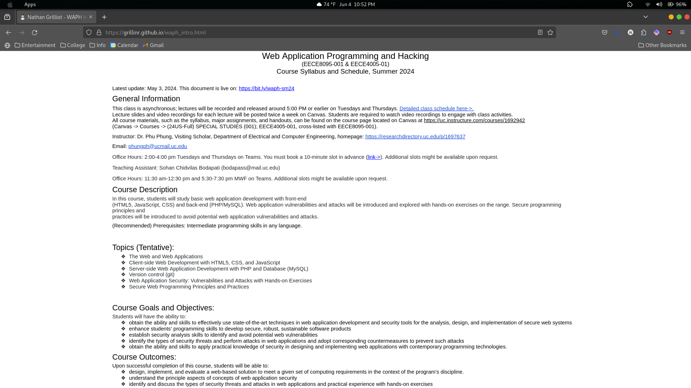
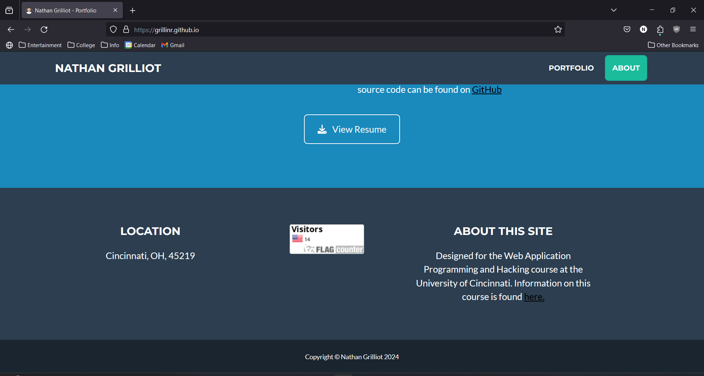
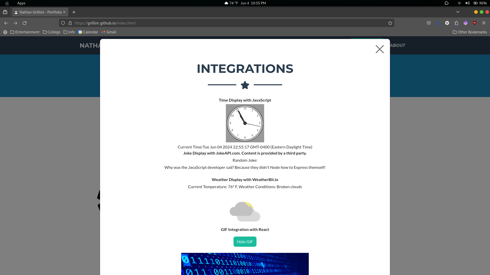
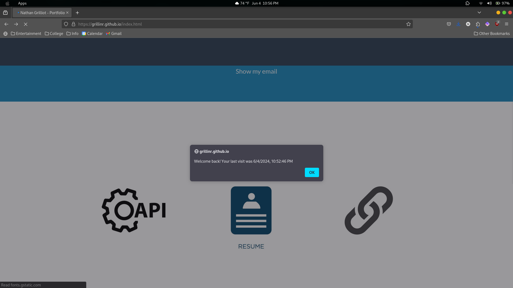

# WAPH-Web Application Programming and Hacking

## Instructor: Dr. Phu Phung

## Student

**Name**: Nathan Grilliot

**Email**: <grillinr@mail.uc.edu>

**Short-bio**: I am a 3rd year computer science student and I am looking forward to learning how to make a web application!

## Repository Information

Respository's URL: [https://github.com/grillinr/waph-grillinr.git](https://github.com/grillinr/waph-grillinr.git)

This is a private repository for Nathan to store all code from the course. The organization of this repository is as follows.

## Individual Project 1: Professional Profile Website

## Overview

[Link to site here](https://grillinr.github.io/)
[Link to repository here](https://github.com/grillinr/grillinr.github.io)

This project is to create a professional portfolio website. It will use various technologies to exhibit the skills we have learned in this class so far. My resume, contact info, and information about this course can be found here (link in about section at the bottom of the site). In addition to this, it incorporates several APIs, various JavaScript snippets, and a simple React integration (under the API section).

### General Requirements

- Deploy site on GitHub cloud. This task helps to show an easy way to create a site using free tools.

- Create a link to new HTML page showing site overview. Doing this teaches how to create links between HTML pages.

### Non-Technical Requirements

- Open source CSS template. Using a template is an easy way to get the basic looks for a site set up easily without the need for manual configuration.

- Page Tracker. This element is a great way to show an image with the number of visitors and where they are from.

### Technical Requirements

- Basic JavaScript. I used the elements from Lab 2 as well as a Gif using React. These show the different ways that JavaScript can be included, giving useful insight into how to develop more efficiently.
- Public web API integreations. The joke and weather APIs show different ways of including information from third-parties into my site. The joke deals with just text, and the weather pulls text and an image that reflects the weather.

- Use JavaScript cookies. Cookies help keep track of information about the visitor to the site and are used by almost all sites. In this case, it remembers the last time the user visited.

